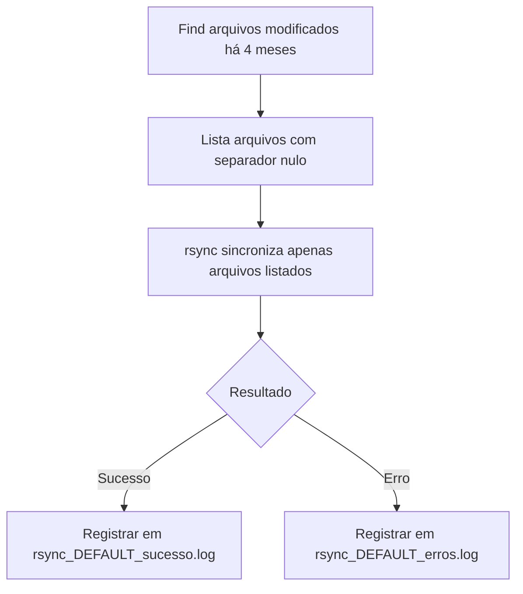

# Sincronização de Arquivos Modificados com `rsync` e `find`

## Objetivo
Transferir apenas os arquivos modificados nos últimos 4 meses do diretório `DEFAULT/` para um servidor remoto via `rsync` com SSH, mantendo logs separados para sucessos e erros.

---

## Comando Utilizado

```bash
find DEFAULT/ -type f -newermt "$(date -d '4 months ago' +%Y-%m-%d)" -print0 | \
rsync -avz --info=progress2 --stats --from0 --files-from=- -e "ssh -p 22" . root@10.10.10.15:/opt/ \
> >(tee -a rsync_DEFAULT_sucesso.log) 2> >(tee -a rsync_DEFAULT_erros.log >&2)
```

---

## Explicação Detalhada

### 1. Localizar Arquivos Alterados

**Comando:**
```bash
find DEFAULT/ -type f -newermt "$(date -d '4 months ago' +%Y-%m-%d)" -print0
```

**Descrição:**
- **DEFAULT/**: Pasta base da pesquisa.
- **-type f**: Considera apenas arquivos (ignora diretórios).
- **-newermt**: Seleciona arquivos modificados após a data gerada (4 meses atrás).
- **-print0**: Gera saída separada por `\0` (compatível com nomes de arquivos com espaços).

---

### 2. Sincronizar Arquivos com `rsync`

**Comando:**
```bash
rsync -avz --info=progress2 --stats --from0 --files-from=- -e "ssh -p 22" . root@10.10.10.15:/opt/
```

**Descrição dos parâmetros:**
- `-a`: Modo arquivamento (preserva permissões, links simbólicos, etc.).
- `-v`: Verbose, mostra o progresso no terminal.
- `-z`: Compressão dos dados durante a transferência.
- `--info=progress2`: Exibe progresso detalhado de cada arquivo.
- `--stats`: Exibe estatísticas detalhadas ao final da transferência.
- `--from0`: Lê arquivos da entrada padrão (`stdin`) separados por `\0`.
- `--files-from=-`: Recebe a lista de arquivos pela entrada padrão.
- `-e "ssh -p 22"`: Utiliza SSH na porta 22 para conectar ao servidor remoto.
- `.`: Diretório de origem atual.
- `root@10.35.101.65:/opt/OS/DEFAULT/`: Caminho de destino no servidor.

---

### 3. Gerar Logs de Sucesso e Erro

**Comando:**
```bash
> >(tee -a rsync_DEFAULT_sucesso.log)
2> >(tee -a rsync_DEFAULT_erros.log >&2)
```

**Descrição:**
- `tee -a`: Anexa (`append`) o output nos arquivos de log.
- `rsync_DEFAULT_sucesso.log`: Log das operações bem-sucedidas.
- `rsync_DEFAULT_erros.log`: Log das operações com erros.

---

## Fluxo Resumido



---

## Possíveis Melhorias Futuras

- Adicionar `--partial` para retomar transferências interrompidas.
- Utilizar `--bwlimit=KBPS` para limitar a banda e evitar sobrecarga de rede.
- Configurar tentativas automáticas de reconexão em caso de falhas.
- Usar `-c` (checksum) para maior validação de integridade dos arquivos.
- Aumentar a compressão usando `--compress-level=9` se necessário.

---

## Considerações Finais
Este procedimento é **seguro**, **automatizado** e **ideal** para ambientes onde:
- Apenas alterações recentes precisam ser copiadas,
- Há necessidade de registros claros de sucesso/erro,
- A performance e a confiabilidade da transferência são fundamentais.
